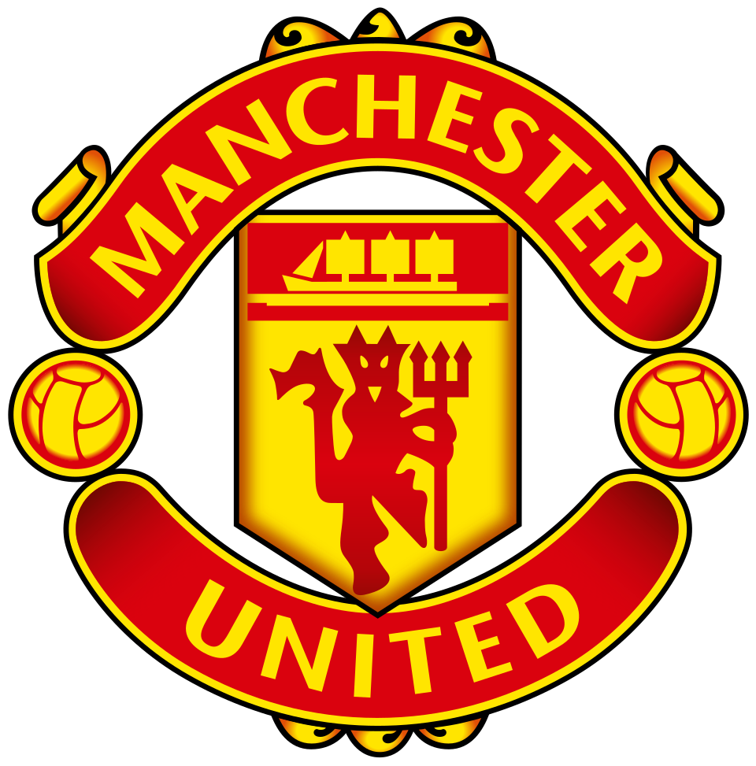

# Manchester United

<div align="center">
  
</div>

Modern Manchester United fan dashboard built with Vue 3 + Vite and football-data.org.

## Environment

Create `.env` in project root:

```sh
VITE_FOOTBALL_API_KEY=your_key_here
```

## Features

- Home dashboard with next fixture highlight and last 5 results
- Fixtures filter (upcoming / finished)
- Players page with search
- Player status fallback: `Active (default)`
- Manchester United red/black/white dark theme
- Loading skeletons, transitions, and responsive card layouts
- Axios API client with localStorage cache (5 minutes)

## Project Structure

- `src/App.vue`
- `src/views/Dashboard.vue`
- `src/views/Players.vue`
- `src/components/Navbar.vue`
- `src/components/FixtureCard.vue`
- `src/components/PlayerCard.vue`
- `src/components/LoadingSkeleton.vue`
- `src/services/footballApi.ts`

## Scripts

```sh
npm install
npm run dev
npm run lint
npm run build
```

## About the club

Manchester United, often called Man Utd or the Red Devils, is a world-famous professional football (soccer) club based in Old Trafford, Greater Manchester, England.